# PROJECT DESCRPTION

_______________________________________________________
This Uber Data Analysis project aims to uncover valuable insights into the rush hour patterns and maximum pickups in the bustling city of New York. By analyzing extensive data collected over the course of 6 months, I will delve into the intricate details of Uber rides during peak hours, identifying the busiest times and locations.  
Through advanced statistical techniques and visualization tools, I will uncover trends, patterns, and correlations that will enable us to optimize operations, improve efficiency, and enhance the overall Uber experience for both drivers and riders.  
This project promises to provide invaluable insights into the dynamics of New York's transportation landscape, ultimately shaping the future of urban mobility.

### Skills/ concepts demonstrated: 

The codes were executed using Jupyter notebook.
- **Pandas :-** collect and modify data
- **Numpy :-** carry out numeric features
- **Matplotlib :-** base model for data visualization
- **Seaborn :-** beautiful and fast plots
- **Ploty :-** dynamic plot

### EXTRACT FILES AND READ DATA FOR ANALYSIS
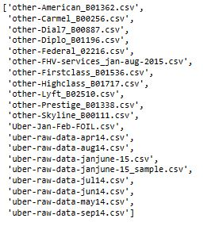  
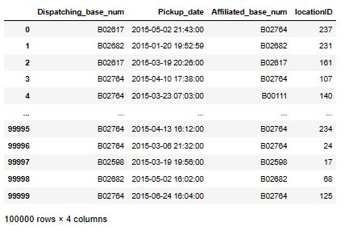

### DATA TRANSFORMATION
Data pre-processing/Data cleaning was carried out.
- Checking and dropping duplicated values   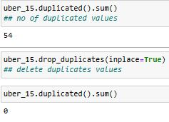
- Checking for missing values   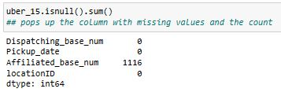
- Converting the "Pickup_date" column to a _data-time_ data type from _object_ data type   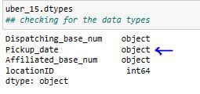   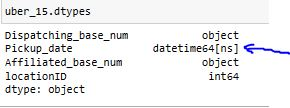

### PROBLEM STATEMENT: Which month have the maximum Uber pickups in New York City?
_______________________________________________________________________________________
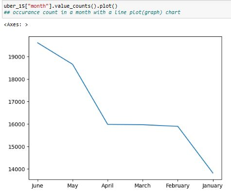  
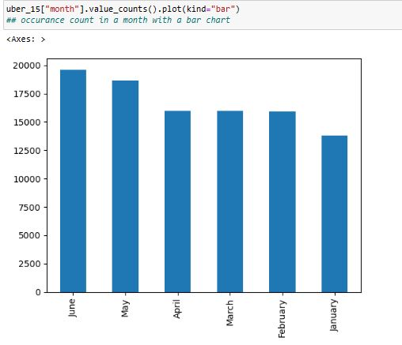

### PROBLEM STATEMENT: Lets find out hourly rush in New York on all days 
___________________________________________________________________________________
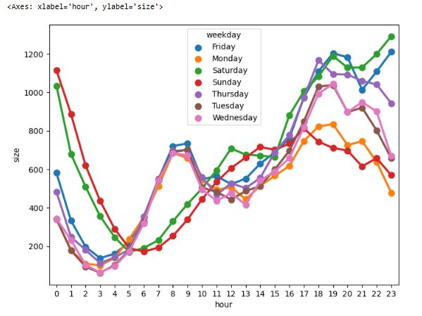 

### PROBLEM STATEMENT: Which base-number has most number of active vehicles?
___________________________________________________________________________________
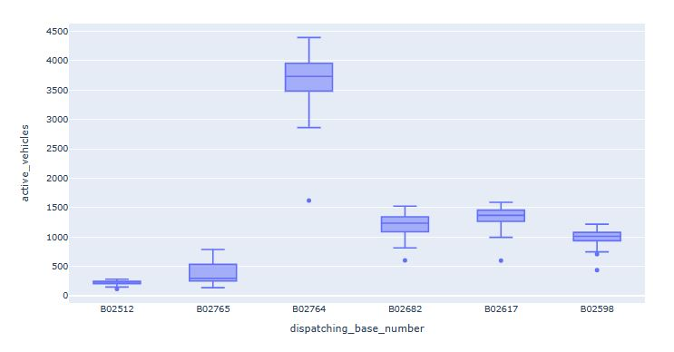 

### PROBLEM STATEMENT: At what locations in New York City we are getting rush?
___________________________________________________________________________________
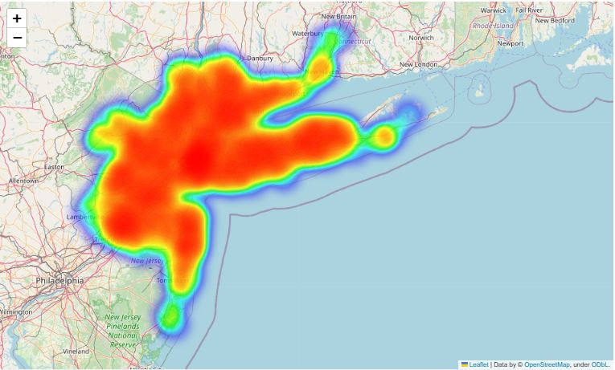 

### PROBLEM STATEMENT: Examine rush on Hour and Weekday
___________________________________________________________________________________
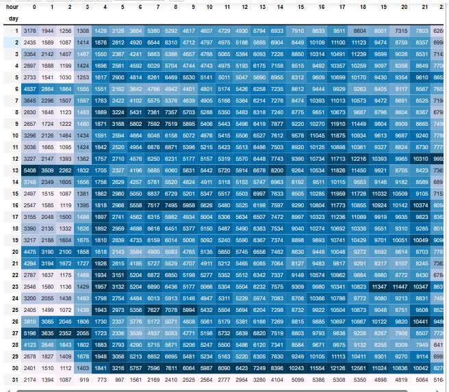 
